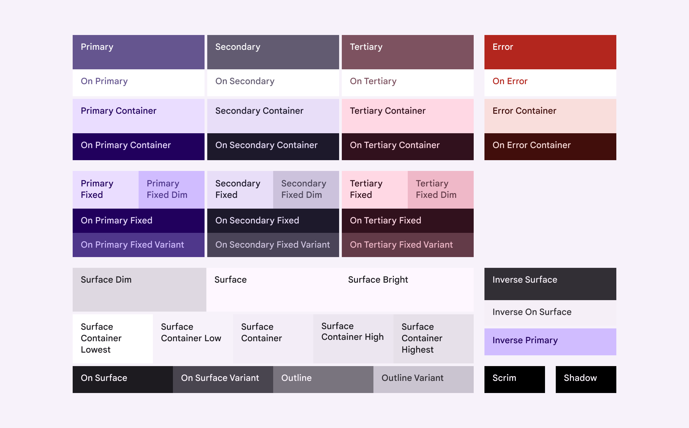
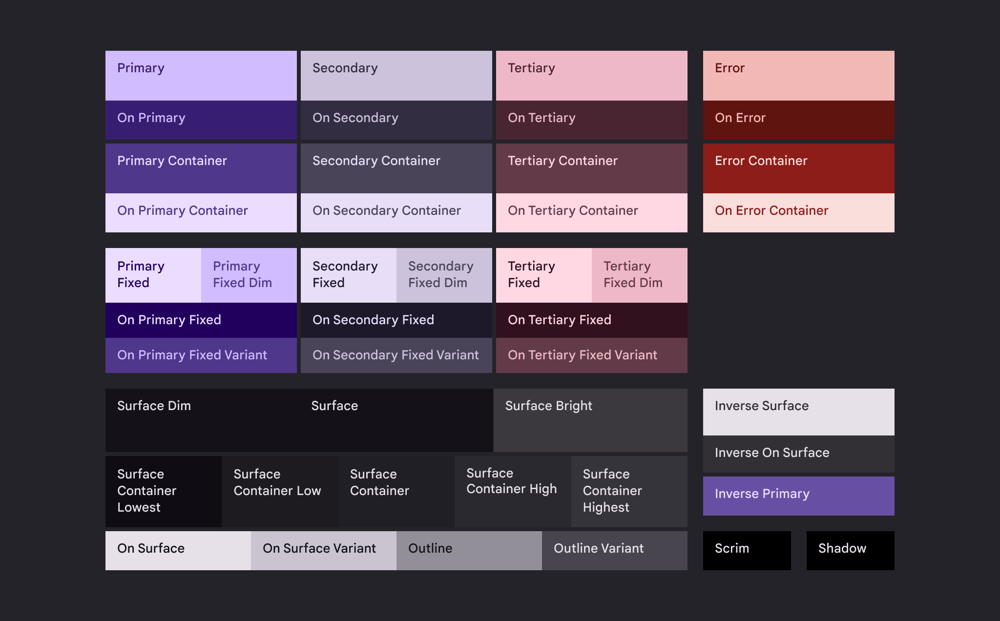

[English](./README.md) · **Русский**

> [!WARNING]
> Поскольку библиотека находится в активной разработке, большинство функций, удобных для разработчиков и организационных функций ещё не реализованы, например:
> - **Вебсайт с документацией**
> - **Комментарии с документацией**
> - **Примеры**
> - **Рабочий процесс разработки**

<div>
  
  <h3>star4</h3>
  <p>Наша официальная система дизайна и UI библиотека</p>
</div>

[~~Документация~~](https://tmol4.github.io/star4) · [Сообщить об ошибке](https://github.com/tmol4/star4/issues) · [Запросить функцию](https://github.com/tmol4/star4/issues)

<details>
<summary><h3>Содержание</h3></summary>

- [Функции](#функции)
- [Использование](#использование)
  - [Установка](#установка)
  - [Тематизация](#тематизация)
    - [Создание темы](#создание-темы)
    - [Применение стилей](#применение-стилей)
    - [Цветовые схемы](#цветовые-схемы)
    - [Шрифты](#шрифты)
  - [Components](#components)
    - [Идентифицируемые компоненты (только React)](#идентифицируемые-компоненты-только-react)
- [Благодарности](#благодарности)

</details>


## Функции

- 🧰 Поддержка нескольких фреймворков
  - [React](packages/react/README.md)
  - [SolidJS](packages/react/README.md)
- 🎨 Дизайн основан на [Material Design 3](https://m3.material.io "m3.material.io")
- 🧱 Простые и комплексные компоненты
- 🧩 Модульная структура

## Использование

### Установка

1. Добавьте Vanilla Extract plugin в проект\
\
  Эта библиотека может быть использована в любом проекте, который поддерживает [Vanilla Extract](https://vanilla-extract.style "vanilla-extract.style"). Все доступные интеграции расположены по ссылке: [*"Bundler Integration"*](https://vanilla-extract.style/documentation/getting-started/#bundler-integration "vanilla-extract.style/documentation/getting-started#bundler-integration"). Вот список интеграций, поддерживающихся на момент написания:
   - [Astro](https://vanilla-extract.style/documentation/integrations/astro "vanilla-extract.style/documentation/integrations/astro") (при помощи `@vanilla-extract/vite-plugin`)
   - [esbuild](https://vanilla-extract.style/documentation/integrations/esbuild "vanilla-extract.style/documentation/integrations/esbuild") (при помощи `@vanilla-extract/esbuild-plugin`)
   - [Gatsby](https://vanilla-extract.style/documentation/integrations/gatsby "vanilla-extract.style/documentation/integrations/gatsby") (при помощи `gatsby-plugin-vanilla-extract`)
   - [Next.js](https://vanilla-extract.style/documentation/integrations/next "vanilla-extract.style/documentation/integrations/next") (при помощи `@vanilla-extract/next-plugin`)
   - [Parcel](https://vanilla-extract.style/documentation/integrations/parcel "vanilla-extract.style/documentation/integrations/parcel") (при помощи `@vanilla-extract/parcel-transformer`)
   - [Remix](https://vanilla-extract.style/documentation/integrations/remix "vanilla-extract.style/documentation/integrations/remix") (при помощи `@vanilla-extract/vite-plugin`)
   - [Rollup](https://vanilla-extract.style/documentation/integrations/rollup "vanilla-extract.style/documentation/integrations/rollup") (при помощи `@vanilla-extract/rollup-plugin`)
   - [Vite](https://vanilla-extract.style/documentation/integrations/vite "vanilla-extract.style/documentation/integrations/vite") (при помощи `@vanilla-extract/vite-plugin`)
   - [Webpack](https://vanilla-extract.style/documentation/integrations/webpack "vanilla-extract.style/documentation/integrations/webpack") (при помощи `@vanilla-extract/webpack-plugin`)
1. Добавьте основную библиотеку Vanilla Extract ([`@vanilla-extract/css`](https://npmjs.com/package/@vanilla-extract/css)):
   <details>
      <summary><a href="https://npmjs.com">npm</a></summary>

      ```sh
      npm install @vanilla-extract/css
      ```
    </details>
   <details>
      <summary><a href="https://pnpm.io">pnpm</a></summary>

      ```sh
      pnpm add @vanilla-extract/css
      ```
    </details>
   <details>
      <summary><a href="https://yarnpkg.com">Yarn</a></summary>

      ```sh
      yarn add @vanilla-extract/css
      ```
    </details>
   <details>
      <summary><a href="https://bun.sh">Bun</a></summary>

      ```sh
      bun add @vanilla-extract/css
      ```
    </details>
2. Установите пакет star4 с утилитами для Vanilla Extract ([`@star4/vanilla-extract`](https://npmjs.com/package/@star4/vanilla-extract)):
   <details>
      <summary><a href="https://npmjs.com">npm</a></summary>

      ```sh
      npm install @star4/vanilla-extract
      ```
    </details>
   <details>
      <summary><a href="https://pnpm.io">pnpm</a></summary>

      ```sh
      pnpm add @star4/vanilla-extract
      ```
    </details>
   <details>
      <summary><a href="https://yarnpkg.com">Yarn</a></summary>

      ```sh
      yarn add @star4/vanilla-extract
      ```
    </details>
   <details>
      <summary><a href="https://bun.sh">Bun</a></summary>

      ```sh
      bun add @star4/vanilla-extract
      ```
    </details>
3. Установите пакет star4 для выбранного фреймворка:
     - React ([`@star4/react`](https://npmjs.com/package/@star4/react)):
       <details>
         <summary><a href="https://npmjs.com">npm</a></summary>

         ```sh
         npm install @star4/react
         ```
       </details>
       <details>
         <summary><a href="https://pnpm.io">pnpm</a></summary>

         ```sh
         pnpm add @star4/react
         ```
       </details>
       <details>
         <summary><a href="https://yarnpkg.com">Yarn</a></summary>

         ```sh
         yarn add @star4/react
         ```
       </details>
       <details>
         <summary><a href="https://bun.sh">Bun</a></summary>

         ```sh
         bun add @star4/react
         ```
       </details>
     - Solid ([`@star4/solid`](https://npmjs.com/package/@star4/solid)):
       <details>
         <summary><a href="https://npmjs.com">npm</a></summary>

         ```sh
         npm install @star4/solid
         ```
       </details>
       <details>
         <summary><a href="https://pnpm.io">pnpm</a></summary>

         ```sh
         pnpm add @star4/solid
         ```
       </details>
       <details>
         <summary><a href="https://yarnpkg.com">Yarn</a></summary>

         ```sh
         yarn add @star4/solid
         ```
       </details>
       <details>
         <summary><a href="https://bun.sh">Bun</a></summary>

         ```sh
         bun add @star4/solid
         ```
       </details>

### Тематизация

Для того, что начать использовать star4, необходимо настроить тему. Это может сделано при помощи пакета [`@star4/vanilla-extract`](https://npmjs.com/package/@star4/vanilla-extract).

#### Создание темы

A theme object can be created in an ordinary (non `.css.*`) file using the `createTheme` helper function:
```ts
import { createTheme } from "@star4/vanilla-extract";

export const { contract, theme } = createTheme({/* ... */});
```

This function accepts an *options* argument, which is an object specifying theme configuration. Some of its fields are required. Here's a minimalist example:
```ts
import { createTheme } from "@star4/vanilla-extract";

export const { contract, theme } = createTheme({
  // Use a static color scheme
  color: {},
  // Specify font families for different font styles
  typeface: {
    plain: "system-ui",
    brand: "sans-serif",
  },
  // Specify the font family used for Material Symbols icons
  component: {
    materialSymbol: {
      font: "Material Symbols Outlined",
    },
  },
});
```

#### Применение стилей

Функция `createTheme` возвращает объект, содержащий две функции: `contract` и `theme`.

Сначала создайте "контракт", используя вспомогательную функцию `contract`:
```ts
// ДАННЫЙ ПРИМЕР ПРЕДПОЛАГАЕТ:
// - тема star4 была создана
// - `contract` был импортирован в файл

export const THEME = contract();
```

Вспомогательная функция `theme` возвращает объект, заполненный CSS значениями, готовый к применению при помощи ([`@vanilla-extract/css`](https://npmjs.com/package/@vanilla-extract/css)) внутри `.css.*` файла. Можно использовать любой API Vanilla Extract, в зависимости от ваших нужд.

Example creating a theme which follows system preference, using [`globalStyle`](https://vanilla-extract.style/documentation/global-api/global-style "vanilla-extract.style/documentation/global-api/global-style") and [`assignVars`](https://vanilla-extract.style/documentation/api/assign-vars "vanilla-extract.style/documentation/api/assign-vars") APIs:
```ts
// ДАННЫЙ ПРИМЕР ПРЕДПОЛАГАЕТ:
// - a star4 theme was created
// - a theme contract named `THEME` was created
// - `theme` helper and `THEME` were imported into this file

import { assignVars, globalStyle } from "@vanilla-extract/css";

const LIGHT_THEME = theme("light");
const DARK_THEME = theme("dark");

globalStyle(
  ":root, ::backdrop",
  {
    colorScheme: "light dark",
    "@media": {
      "(prefers-color-scheme: light)": {
        vars: assignVars(THEME, LIGHT_THEME),
      },
      "(prefers-color-scheme: dark)": {
        vars: assignVars(THEME, DARK_THEME),
      },
    },
  },
);
```
Here is a more complicated example, allowing overriding the current theme mode using a data attribute:
```ts
// ДАННЫЙ ПРИМЕР ПРЕДПОЛАГАЕТ:
// - a star4 theme was created
// - a theme contract named `THEME` was created
// - `theme` helper and `THEME` were imported into this file

import { assignVars, globalStyle } from "@vanilla-extract/css";

// A helper function for creating attribute selectors
const createThemeSelector = (
  themes: string | string[],
  not: boolean = false,
) => {
  const values = typeof themes === "string" ? [themes] : themes;
  const attributes = values.map(
    theme => `[data-theme="${theme}"]`,
  );
  let is = `:is(${attributes.join(",")})`;
  if(not) is = `:not(${is})`;
  return `:root${is}, ${is} ::backdrop`;
}

// Store filled theme objects for reuse
const LIGHT_THEME = theme("light");
const DARK_THEME = theme("dark");

// Possible data-theme attribute values
const DATA_THEME_LIGHT = "light";
const DATA_THEME_DARK = "dark";


// Follow system theme mode if no
// [data-theme="light"] or [data-theme="dark"]
// attribute was found
globalStyle(
  createThemeSelector([DATA_THEME_LIGHT, DATA_THEME_DARK], true),
  {
    colorScheme: "light dark",
    "@media": {
      "(prefers-color-scheme: light)": {
        vars: assignVars(THEME, LIGHT_THEME),
      },
      "(prefers-color-scheme: dark)": {
        vars: assignVars(THEME, DARK_THEME),
      },
    },
  },
);

// If <html> has a [data-theme="light"]
// attribute, apply the light theme
globalStyle(
  createThemeSelector(DATA_THEME_LIGHT),
  {
    colorScheme: "light",
    vars: assignVars(THEME, LIGHT_THEME),
  }
);

// If <html> has a [data-theme="dark"]
// attribute, apply the dark theme
globalStyle(
  createThemeSelector(DATA_THEME_DARK),
  {
    colorScheme: "dark",
    vars: assignVars(THEME, DARK_THEME),
  }
);
```

#### Цветовые схемы

star4 uses the [Material You color system](https://m3.material.io/styles/color/system "m3.material.io/styles/color/system"), which provides two options for creating color schemes: [**static**](https://m3.material.io/styles/color/static/baseline "m3.material.io/styles/color/static/baseline") and [**dynamic**](https://m3.material.io/styles/color/dynamic "m3.material.io/styles/color/dynamic"). See [*Choosing a scheme*](https://m3.material.io/styles/color/choosing-a-scheme "m3.material.io/styles/color/choosing-a-scheme") for advice.

<details>
  <summary><b>Статическая цветовая схема</b></summary>
  <br>
  <p>Светлая</p>
  
  <br>
  <br>
  <p>Тёмная</p>
  
</details>

> [!WARNING]
> Поведение свойства `color` может быть изменено в будущем.

The `color` property is responsible for color scheme configuration. Settings it to an empty object `{}` will assert a static scheme, while creating a dynamic scheme requires specifying a few properties.

Пример статической цветовой схемы:
```ts
export const { contract, theme } = createTheme({
  // Empty object - using a static color scheme
  color: {},
  /* ... other fields... */
});
```

Пример динамической цветовой схемы:
```ts
export const { contract, theme } = createTheme({
  color: {
    // A total of 9 variants are available
    variant: "tonalSpot"
    // Can be a hex, rgb CSS color, or an Hct instance
    sourceColor: "#00ff00",
    // Defaults to 0. Allows changing color scheme contrast
    contrastLevel: 0,
  },
  /* ... other fields... */
});
```

#### Шрифты

Font family names containing spaces must be quoted in CSS.

Here is a helper function for merging CSS font names:
```ts
type FontFamily = (string | FontFamily)[];

const fontFamily = (...args: FontFamily): string => {
  return args
    .map(
      value => typeof value === "string"
        ? value.includes(" ")
          ? `"${value}"`
          : value
        : fontFamily(...value),
    )
    .join(", ");
}
```

If using variable fonts from [FontSource](https://fontsource.org "fontsource.org"), their font family names have ` Variable` appended to them, e.g. `Open Sans Variable`, so here is a helper for FontSource fonts:
```ts
// Use system font if available,
// otherwise load the FontSource font
const fontSource = (family: string) => {
  return [`${family}`, `${family} Variable`];
};
```
Here's an example showcasing both helpers in action:

```ts
// Gets transformed to:
// "Roboto Flex", "Roboto Flex Variable", "Open Sans", "Open Sans Variable", Roboto, system-ui, Arial, sans-serif
const TYPEFACE_PLAIN = fontFamily(
  fontSource("Roboto Flex"),
  fontSource("Open Sans"),
  "Roboto",
  "system-ui",
  "Arial",
  "sans-serif",
);

// Gets transformed to:
// Raleway, "Raleway Variable", Manrope, "Manrope Variable", sans-serif
const TYPEFACE_BRAND = fontFamily(
  fontSource("Raleway"),
  fontSource("Manrope"),
  "sans-serif",
);
export const { contract, theme } = createTheme({
  typeface: {
    plain: TYPEFACE_PLAIN,
    brand: TYPEFACE_BRAND,
  },
  /* other fields */
});

```

### Components

star4 framework packages export all available components, most of them contain documentation comments and code samples, so documentation for each component will not be provided here.

#### Идентифицируемые компоненты (только React)

Пакет [`@star4/react`](https://npmjs.com/package/@star4/react) содержит вспомогательную функцию `.is()` для каждого компонента. Эта функция может быть использована для определения, является ли React элемент экземпляром конкретного компонента. Она прекрасно подходит для фильтрации дочерних элементов:
```tsx
import { Children, type ReactNode } from "react";
import { Button } from "@star4/react";

// Данный компонент отображает только экземпляры Button
// Выводит предупреждение, если передаются прочие элементы
export function OnlyButtons({ children }: { children: ReactNode }) {
  const buttons = Children.toArray(children)
    .filter(node => {
      const is = Button.is(node);
      if(!is) console.warn(
        "Invalid JSX Element passed to token resolver:",
        node,
      );
      return is;
    });

  return buttons;
}
```

> [!WARNING]
> Название и возвращаемое значение функции `createIdentifiableElement` могут измениться в будущем

Свои компоненты можно сделать идентифицируемыми, используя функцию `createIdentifiableElement`. Мы рекомендуем именовать ваши компоненты, как в примере:
```tsx
import { createIdentifiableElement } from "@star4/react";

// forwardRef также может быть использована вместо прямого присвоения
const ExampleComponent = function Example() {

}

export const Example = Object.assign(
  // memo(ExampleComponent) также может быть использовано для мемоизации
  ExampleComponent,
  // IS_EXAMPLE - это описание объекта Symbol,
  // созданного для идентификации элемента
  createIdentifiableElement("IS_EXAMPLE"),
);

// Используйте компонент
<Example />

// Идентифицируйте элемент
Example.is(something)
```

## Благодарности

star4 был возможен только благодаря следующим замечательным проектам:

- [**Solid Primitives**](https://primitives.solidjs.community "primitives.solidjs.community") - [GitHub](https://github.com/solidjs-community/solid-primitives/tree/main/packages/active-element)\
Настоящий "швейцарский нож" для SolidJS.
<!-- ###### GitHub: [solidjs-community/solid-primitives](https://github.com/solidjs-community/solid-primitives/tree/main/packages/active-element) -->

- [**Material Web**](https://material-web.dev "material-web.dev") - [GitHub](https://github.com/solidjs-community/solid-primitives/tree/main/packages/active-element)\
Официальная библиотека web компонентов Material Design 3.

- [**usehooks-ts**](https://usehooks-ts.com "usehooks-ts.com") - [GitHub](https://github.com/juliencrn/usehooks-ts)\
Замечательная библиотека React хуков.
